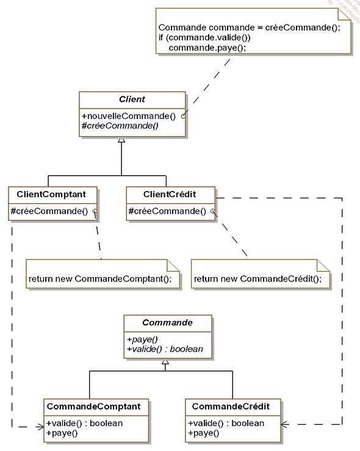
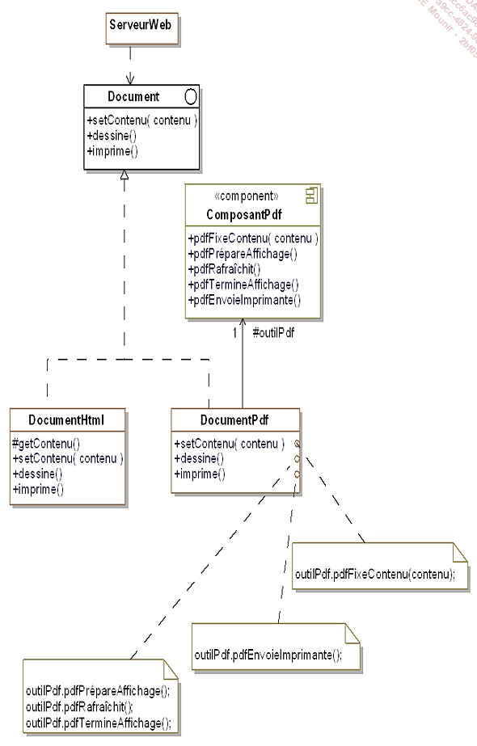
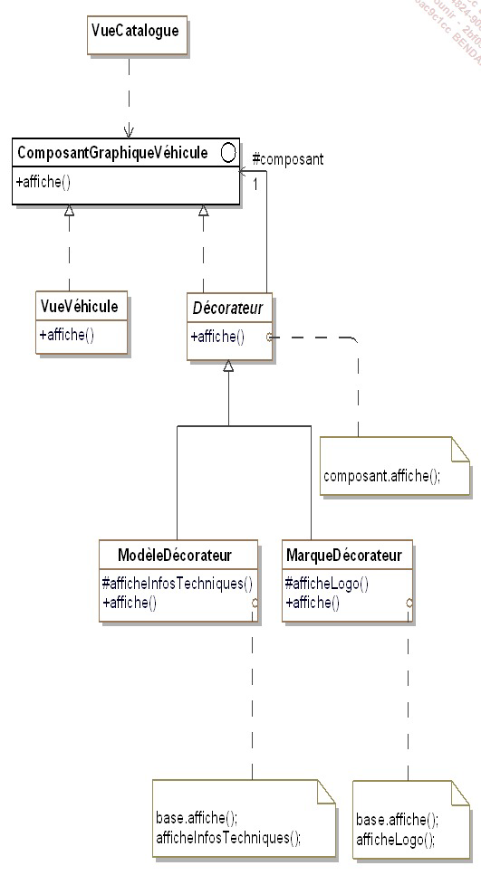
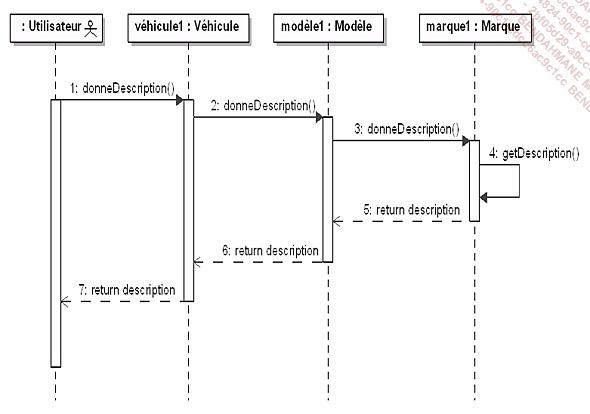

### Figure 1 : 

### classe abstrete : redefinir les methodes sur les autres classes 

# Design patterns (template) : 
Description des patterns :
 nom :
 description :
 exemple de code sous forme du diagramme UML:
 la structure abstraite:
 un exemple de code :

# Premiere famille de pattern: les patterns de construction 

### Signelton : permet une seule classe avec une seul instance 
 ## Le Abstract Factory :
## Figure 2 :

catalogue va prendre une instance de l'interfce fabrique véhicule 

# Le pattern builder:
## figure 3 :

permet d"abstraire la construction d'objets complexes de leur implantation de sorte qu'un client puisse créer des objets
complexes sans avoir a se preoccuper des differences d'implantation .

# Le pattern Factory method :

- le but de ce pattern est d'introduire une méthode abstraite de creation d'objets en respectant 
la sous classes concrètes la creation effective .

### Le pattern Singleton : il faut s'assurer de deuc choses lorsqu'on veut mettre en place ce pattern :
- une classe ne doit posseder qu'une seule instance .
- il faut fournir une methode de classe qui permet de fournir cette instance unique .

# Le pattern prototype

 le but de ce pattern est de créer de nouveaux objects en dupliquant des objects existants appeles prototypes 
 ces derniers disposent d'une capacité de clonage

# 2éme famille de pattern : les patterns de structuration :
 
## Introduction :
L’objectif des patterns de structuration est de faciliter l’indépendance de l’interface d’un objet ou d’un
ensemble d’objets vis-à-vis de son implantation. Dans le cas d’un ensemble d’objets, il s’agit aussi de
rendre cette interface indépendante de la hiérarchie des classes et de la composition des objets.
En fournissant les interfaces, les patterns de structuration encapsulent la composition des objets,
augmentant le niveau d’abstraction du système à l’image des patterns de création qui encapsulent la
création des objets. Les patterns de structuration mettent en avant les interfaces.
L’encapsulation de la composition est réalisée non pas en structurant l’objet lui-même mais en transférant
cette structuration à un second objet. Celui-ci est intimement lié au premier objet. Ce transfert de
structuration signifie que le premier objet détient l’interface vis-à-vis des clients et gère la relation avec le
second objet qui lui gère la composition et n’a aucune interface avec les clients externes.

# Le pattern Adapter

le but ici est d'adapter l'interface d'une classe donnée afin qu'elle puissent interagir avec un client .

# Le pattern Decorator

ici on cherche à ajouter des fonctionnalites supp a un objet en prenant soin de ne pas modifier son interface
Toutes modifications apportées par ce pattern seront transparentes vis-à-vis des clients .
ce pattern constitue une alternative à la création se sous classe pour enrichir les fonctionalités d'un objet .
cas d'utlisation :
- notre application souhaite  ajouter dynamiquement des fonctionnalités à un objet sans modifier son interface autrement 
dit sans avoir a modifier les clients de cet objet 
- une application doit gerer des fonctionnalités qui peuvent être retirées dynamiquement .
- l'utlisation de l'heritage n'est pas une option car la hierachie d'objets est deja trop complexe .

# Le pattern Bridge 

 Séparer une grosse classe ou un ensemble de classes en abstraction et implementation

 # Le pattern Composite 
 
   Compose des objets en des structures arborescentes.
   Pour notre exemple de figure  :Le pattern résout ce problème en unifiant l’interface des deux types de sociétés et en
utilisant la composition récursive. Cette composition récursive est nécessaire car une société peut
posséder des filiales qui possèdent elles-mêmes d’autres filiales.

#  3éme famille de patterns : Les patterns de comportement 

##  pattern Chain of responsability

 

